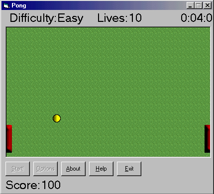



## BitBlt Pong

### Description

After learning some basic BitBlt, this shows you how to implement BitBlt into a game such as pong.
 
### More Info
 

             |
---                |---
**Submitted On**   |2000-12-23 16:27:18
**By**             |[Steve Mack](https://github.com/Planet-Source-Code/PSCIndex/blob/master/ByAuthor/steve-mack.md)
**Level**          |Intermediate
**User Rating**    |4.7 (14 globes from 3 users)
**Compatibility**  |VB 5\.0, VB 6\.0
**Category**       |[Games](https://github.com/Planet-Source-Code/PSCIndex/blob/master/ByCategory/games__1-38.md)
**World**          |[Visual Basic](https://github.com/Planet-Source-Code/PSCIndex/blob/master/ByWorld/visual-basic.md)
**Archive File**   |[CODE\_UPLOAD1299212232000\.zip](https://github.com/Planet-Source-Code/steve-mack-bitblt-pong__1-13824/archive/master.zip)

